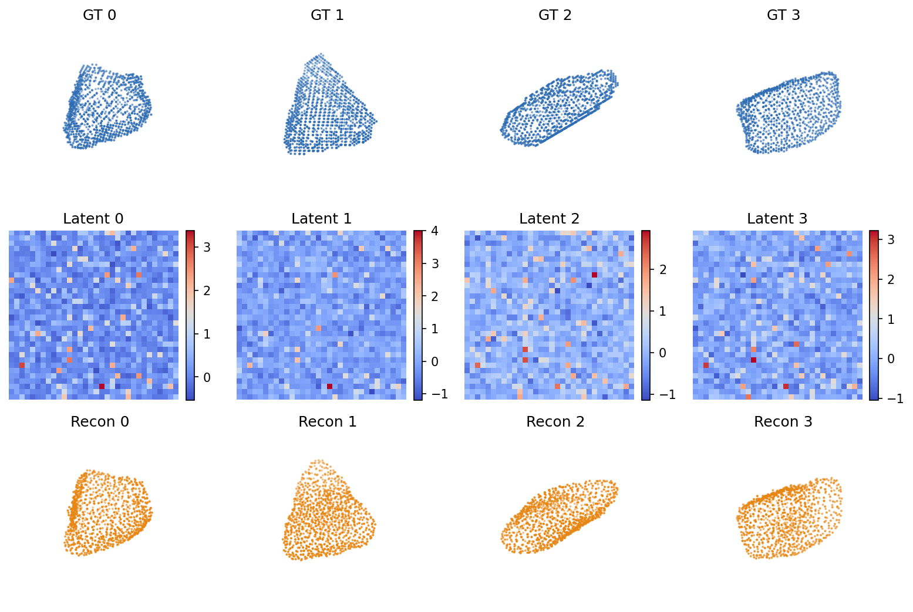
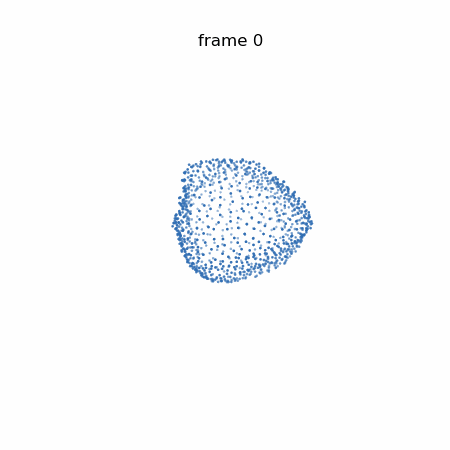

# PC_AE_Video_DDPM

Controlled synthetic shape-transformation latent video diffusion for point
clouds.

Self-contained pipeline driven by a single script,
[`DDPM_Video__PCAE.py`](DDPM_Video__PCAE.py), that trains a PointCloud
autoencoder, encodes point clouds into compact latent grids, builds latent
videos (either by linear interpolation or by controlled synthetic
deformation), trains endpoint-conditioned and control-conditioned latent
video DDPMs, samples latent trajectories, and decodes them back into
point-cloud video frames.

<p align="center">
  
</p>

<p align="center">
  <em>PointCloudAE reconstructions at the current best epoch
  (full_32, epoch 18, val loss 0.2522).
  Top: ground-truth point clouds. Middle: 32&times;32 latent grids.
  Bottom: AE reconstructions.</em>
</p>

<p align="center">
  
</p>

<p align="center">
  <em>Decoded point-cloud video from the endpoint-conditioned latent video
  DDPM (pilot_32, 10k pairs, sample_0003). 10 frames, each frame is the AE
  decoder applied to a sampled latent grid.</em>
</p>

## 1. What this project does

- Trains a PointCloud autoencoder on normalized point clouds.
- Encodes every point cloud into a `[latent_size, latent_size]` latent grid.
- Builds two flavors of synthetic latent video datasets:
  - linear interpolation between AE-latent endpoints (endpoint conditioning);
  - controlled synthetic shape transformations, with a 16-d control vector.
- Trains an endpoint-conditioned latent video DDPM.
- Trains a control-conditioned latent video DDPM.
- Samples latent video trajectories and decodes each frame through the
  frozen AE into a point cloud.
- Writes preview images, gif animations, optional mp4s, and a markdown audit
  report.

## 2. Input data

- Path: `data/normalized_rotated_point_clouds6.npy`
- Expected shape: `(N, 1000, 6)` – 1000 points per sample, 6 features
  (xyz + normal/feature triple).
- Current shape on disk: `(11892, 1000, 6)`, `float64`.

## 3. Main script

- [`DDPM_Video__PCAE.py`](DDPM_Video__PCAE.py)

Helper scripts (auditing/visualization, optional):

- [`evaluate_pilot_samples.py`](evaluate_pilot_samples.py) – computes
  per-sample statistics (frame-to-frame L2, endpoint L2, finiteness, asset
  presence) and writes a `pilot_sample_eval.json` next to the samples.
- [`make_pointcloud_video_previews.py`](make_pointcloud_video_previews.py) –
  rebuilds per-sample animation gifs and mp4s from decoded `frame_*.npy`.

## 4. Core model stages

### Stage 1 – PointCloudAE
- Input: point cloud `[1000, 6]`.
- Encoder maps the cloud to a latent grid `[latent_size, latent_size]`,
  typically `[32, 32]`.
- Decoder reconstructs `[1000, 6]`.
- Trained independently of the DDPM.

### Stage 2 – Latent encoding
- The frozen AE encodes every point cloud into a latent grid.
- Example output: `outputs/latent_videos_full_32/encoded_features.npy`.

### Stage 3 – Linear endpoint latent videos
- Builds simple linear-interpolation videos between two latent endpoints.
- Used as the first endpoint-conditioned DDPM baseline (no controls).

### Stage 4 – Controlled synthetic shape-transformation videos
- Applies synthetic geometric deformations directly to point clouds.
- Encodes every transformed frame through the frozen AE.
- Saves latent video tensors plus a 16-d control vector per sequence and a
  mode-label array.

### Stage 5 – Endpoint-conditioned latent video DDPM
- 3D U-Net learns to generate middle latent frames given the start and end
  latent frames as context.

### Stage 6 – Control-conditioned latent video DDPM
- Same architecture, additionally conditioned on the control vector (and
  the integer mode id via the control vector).

### Stage 7 – Sampling and decoding
- Generated latent frames are decoded through the AE decoder into
  point-cloud frames.
- Per sample, the pipeline writes `frame_000.npy ... frame_009.npy`,
  `latent_video.npz`, `preview.png`, `animation.gif`, and (for controlled
  sampling) `control_vector.npy` and `control_config.json`.

## 5. Controlled deformation modes

Implemented in `_generate_transformation_frames` and parameterized by
`_sample_params_for_mode`:

- **cavity_expansion** – radial outward push of a spherical shell of points
  around a center, ramped from 0 to a max strength across frames.
- **cavity_contraction** – inverse cavity_expansion: radial inward pull.
- **anisotropic_expansion** – directional stretch along an axis, ramped
  monotonically.
- **twist** – rotation of points around an axis with rotation angle ramped
  across frames; can also be combined with a shear depending on params.
- **hybrid_cavity_twist** – cavity displacement and twist applied jointly.
- **bulge_then_relax** – cavity strength follows a smooth ramp up and then
  back down (uses `_alpha_bulge`), producing a transient bulge.
- **two_stage_morph** – two-stage trajectory: cavity ramps over the first
  half of frames, then twist ramps over the second half.

## 6. Control vector schema (16-d)

| idx | name                           |
| --- | ------------------------------ |
| 0   | mode_id (normalized)           |
| 1   | cavity_radius                  |
| 2   | shell_width                    |
| 3   | max_strength                   |
| 4   | twist_strength                 |
| 5   | anisotropy_strength            |
| 6   | center_x                       |
| 7   | center_y                       |
| 8   | center_z                       |
| 9   | axis_x                         |
| 10  | axis_y                         |
| 11  | axis_z                         |
| 12  | num_frames (normalized)        |
| 13  | latent_size (normalized)       |
| 14  | phase_or_relaxation_strength   |
| 15  | composite_strength / reserved  |

## 7. CLI commands

Listed by the top-level `--help`:

- `train_ae` – train the PointCloudAE.
- `encode_dataset` – encode all point clouds into AE latent grids.
- `build_latent_videos` – build a linear-interpolation latent video dataset.
- `train_video_ddpm` – train the endpoint-conditioned latent video DDPM.
- `sample_video` – sample one endpoint-conditioned latent video and decode
  each frame.
- `build_controlled_shape_videos` – build the controlled synthetic shape
  transformation latent video dataset.
- `train_controlled_video_ddpm` – train the control-conditioned latent
  video DDPM.
- `sample_controlled_video` – sample one controlled latent video and decode
  each frame.
- `audit_controlled_videos` – write a markdown audit report for a controlled
  run.
- `run_all` – convenience wrapper running AE → encode → build → train DDPM
  → sample once.

## 8. Example workflow (full 32-latent run)

### Train the AE
```bash
python3 DDPM_Video__PCAE.py --seed 123 train_ae \
  --pointcloud_path data/normalized_rotated_point_clouds6.npy \
  --ae_ckpt_dir checkpoints/ae_video_pcae_full_32 \
  --latent_size 32 \
  --ae_batch_size 16 \
  --ae_epochs 500 \
  --patience 50 \
  --ae_lr 1e-4 \
  --val_split 0.1
```

### Encode the dataset
```bash
python3 DDPM_Video__PCAE.py --seed 123 encode_dataset \
  --pointcloud_path data/normalized_rotated_point_clouds6.npy \
  --ae_ckpt_dir checkpoints/ae_video_pcae_full_32 \
  --encoded_features outputs/latent_videos_full_32/encoded_features.npy \
  --encode_batch_size 64
```

### Build controlled synthetic shape videos
```bash
python3 DDPM_Video__PCAE.py --seed 123 build_controlled_shape_videos \
  --pointcloud_path data/normalized_rotated_point_clouds6.npy \
  --ae_ckpt_dir checkpoints/ae_video_pcae_full_32 \
  --controlled_video_path outputs/controlled_latent_videos_full_32/controlled_shape_videos_50k.npy \
  --control_path outputs/controlled_latent_videos_full_32/controlled_shape_controls_50k.npy \
  --num_sequences 50000 \
  --num_frames 10 \
  --latent_size 32 \
  --encode_batch_size 64 \
  --deformation_modes cavity_expansion,cavity_contraction,anisotropic_expansion,twist,hybrid_cavity_twist,bulge_then_relax,two_stage_morph \
  --deformation_mode_probs 0.22,0.08,0.20,0.15,0.15,0.10,0.10 \
  --control_dim 16 \
  --use_best_ae
```

### Train the controlled DDPM
```bash
python3 DDPM_Video__PCAE.py --seed 123 train_controlled_video_ddpm \
  --latent_video_path outputs/controlled_latent_videos_full_32/controlled_shape_videos_50k.npy \
  --control_path outputs/controlled_latent_videos_full_32/controlled_shape_controls_50k.npy \
  --video_ddpm_ckpt_dir checkpoints/controlled_video_ddpm_full_32_50k \
  --batch_size 8 \
  --epochs 500 \
  --patience 25 \
  --lr 1e-4 \
  --timesteps 1000 \
  --beta_schedule cosine \
  --base_channels 32 \
  --control_dim 16 \
  --val_split 0.1
```

> The CLI command name is exactly `train_controlled_video_ddpm` (all
> lowercase `ddpm`).

### Sample one controlled video
```bash
python3 DDPM_Video__PCAE.py --seed 123 sample_controlled_video \
  --encoded_features outputs/latent_videos_full_32/encoded_features.npy \
  --pointcloud_path data/normalized_rotated_point_clouds6.npy \
  --ae_ckpt_dir checkpoints/ae_video_pcae_full_32 \
  --video_ddpm_ckpt_dir checkpoints/controlled_video_ddpm_full_32_50k \
  --start_index 0 \
  --end_index 10 \
  --num_frames 10 \
  --sample_dir outputs/controlled_samples_full_32_50k \
  --sample_id 0 \
  --mode cavity_expansion \
  --cavity_radius 0.35 \
  --shell_width 0.15 \
  --max_strength 0.10
```

### Audit a controlled run
```bash
python3 DDPM_Video__PCAE.py audit_controlled_videos \
  --sample_dir outputs/controlled_samples_full_32_50k \
  --latent_video_path outputs/controlled_latent_videos_full_32/controlled_shape_videos_50k.npy \
  --control_path outputs/controlled_latent_videos_full_32/controlled_shape_controls_50k.npy \
  --video_ddpm_ckpt_dir checkpoints/controlled_video_ddpm_full_32_50k \
  --ae_ckpt_dir checkpoints/ae_video_pcae_full_32 \
  --output_report outputs/controlled_samples_full_32_50k/audit_report.md
```

## 9. Outputs and checkpoint layout

Checkpoint directories used by the canonical workflow:

- `checkpoints/ae_video_pcae_full_32/`
  - `ae_best.pth`, `ae_final.pth`, `ae_latest.pth`,
    `ae_meta.json`, `ae_epoch_losses.txt`, `epoch_viz/ae_epoch_XXXX.png`.
- `checkpoints/controlled_video_ddpm_full_32_50k/`
  - `controlled_video_ddpm_best.pt`,
    `controlled_video_ddpm_final.pt`,
    `controlled_video_ddpm_latest.pt`,
    `controlled_video_ddpm_meta.json`,
    `controlled_video_ddpm_epoch_losses.txt`.

Output directories used by the canonical workflow:

- `outputs/latent_videos_full_32/` – `encoded_features.npy` and any
  endpoint-DDPM build artifacts.
- `outputs/controlled_latent_videos_full_32/` –
  `controlled_shape_videos_50k.npy`,
  `controlled_shape_controls_50k.npy`,
  `controlled_shape_videos_50k.labels.npy`,
  `controlled_shape_videos_50k.meta.json`.
- `outputs/controlled_samples_full_32_50k/sample_XXXX/` – `frame_000.npy
  ... frame_009.npy`, `latent_video.npz`, `preview.png`, `animation.gif`,
  `control_vector.npy`, `control_config.json`, and (after audit)
  `audit_report.md`.

The repo also retains the pilot/smoke artifacts that informed the full
workflow:

- `checkpoints/ae_video_pcae_pilot_32/`, `checkpoints/video_ddpm_pcae_pilot_32_10k/`
- `checkpoints/controlled_video_ddpm_smoke_32/`
- `outputs/latent_videos_pilot_32/`, `outputs/video_samples_pilot_32_10k/`
- `outputs/controlled_latent_videos_32/`, `outputs/controlled_samples_smoke_32/`

## 10. Validation – what to check

For each run, verify:

- Tensor shapes match expectations (encoded features `(N, L, L)`; videos
  `(N, T, L, L)`; controls `(N, 16)`; samples `(P, 6)`).
- Values are finite (`np.isfinite(...).all()`).
- Frame count equals `--num_frames`.
- `preview.png` and `animation.gif` exist and are non-empty.
- Train/validation losses in `*_epoch_losses.txt` are decreasing and
  bounded.
- For controlled runs, `audit_controlled_videos` writes a report with
  per-sample statistics and asset checks.

## 11. Monitoring

```bash
watch -n 10 'nvidia-smi'
tail -f logs/ae_full_32.log
tail -f logs/controlled_video_ddpm_full_32_50k.log
tail -n 20 checkpoints/ae_video_pcae_full_32/ae_epoch_losses.txt
tail -n 20 checkpoints/controlled_video_ddpm_full_32_50k/controlled_video_ddpm_epoch_losses.txt
```

The repo ships with the pilot-era logs under `logs/` (`ae_full_32.log`,
`ae_resume.log`, `build_videos.log`, `encode.log`, `video_ddpm.log`,
`video_ddpm_resume.log`, `video_ddpm_resume_to40.log`). The
`controlled_video_ddpm_full_32_50k.log` filename is the recommended target
for the full controlled DDPM run; it will be written by `nohup ... &` or
`tee` at run time and is not present yet.

## 12. Scientific limitations

- This is a controlled synthetic shape-transformation model. Deformations
  are synthetic; they are not ground-truth physical trajectories.
- The model should not be presented as physically realistic or
  state-of-the-art without external validation against measured data.
- Generation quality is bounded by AE reconstruction quality. If the AE
  cannot reconstruct a microstructure cleanly, the DDPM cannot either.
- Endpoint and control conditioning can be ambiguous for multi-stage
  transformations (e.g., `bulge_then_relax`, `two_stage_morph`): two
  qualitatively different trajectories can share the same endpoint pair.
- Linear latent interpolation and controlled synthetic deformation are
  generation scaffolds, not real observed temporal dynamics. They are
  useful for learning a smooth latent video manifold, not for forecasting.

## 13. Recommended next experiments

- Train a `latent_size = 64` AE and compare reconstruction and downstream
  DDPM quality against `latent_size = 32`.
- Compare the endpoint-only DDPM (`train_video_ddpm`) head-to-head with the
  control-conditioned DDPM (`train_controlled_video_ddpm`) on identical
  endpoints, to isolate the contribution of the control vector.
- Scale controlled trajectories to 100k if disk and wallclock allow.
- Add an explicit mode embedding or class-conditioning input instead of
  packing `mode_id` into channel 0 of the control vector.
- Improve the AE with Chamfer / EMD / F-score reconstruction metrics in
  addition to the current loss.
- Explore tokenized latent point diffusion (per-point latents instead of a
  spatial grid) as a follow-up architecture.

## 14. Reproducibility

- Pass `--seed 123` to every command in the canonical workflow.
- Targeted hardware is a single CUDA GPU. The script falls back to CPU but
  will be far too slow for the full configuration.
- Large artifacts (checkpoints, encoded features, latent video tensors,
  decoded samples) are intentionally local. They are not suitable for
  vanilla GitHub – use git-lfs, a separate object store, or just keep them
  out of source control.

## 15. Files outside the main pipeline

`cleanup_archive/` holds files that were in the original working repo but
are not part of this pipeline (the old Kinetics video DDPM stack under
`models/`, `diffusion/`, `utils/`, `metrics/`, `configs/`, `runs/`,
`scripts/`, the old `DDPM_PCAE (1).py`, the old `data/PointCloud_AE.py`
and related notebooks, and old/unused datasets). Nothing in
`cleanup_archive/` is imported by `DDPM_Video__PCAE.py`. Inspect it before
deleting it.

## License

[LICENSE](LICENSE)
